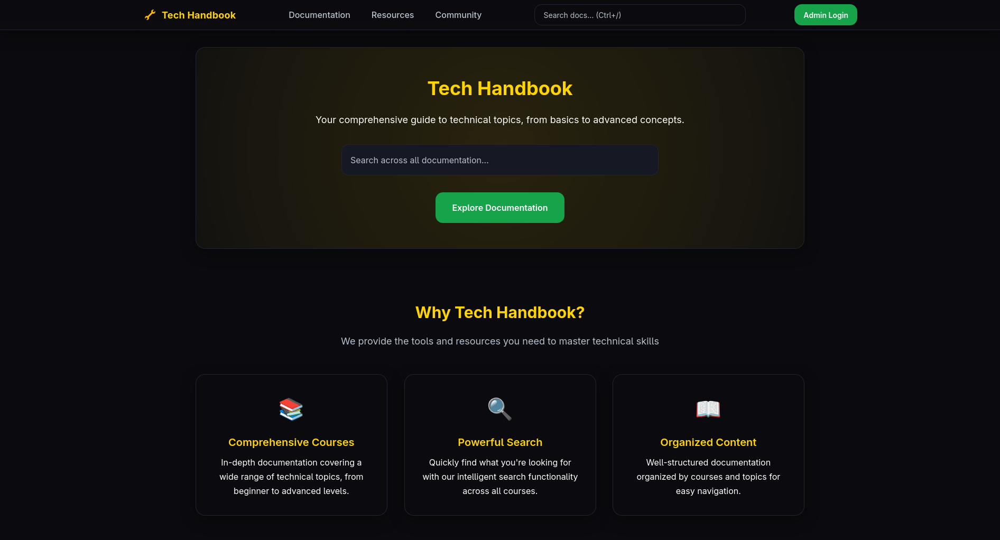
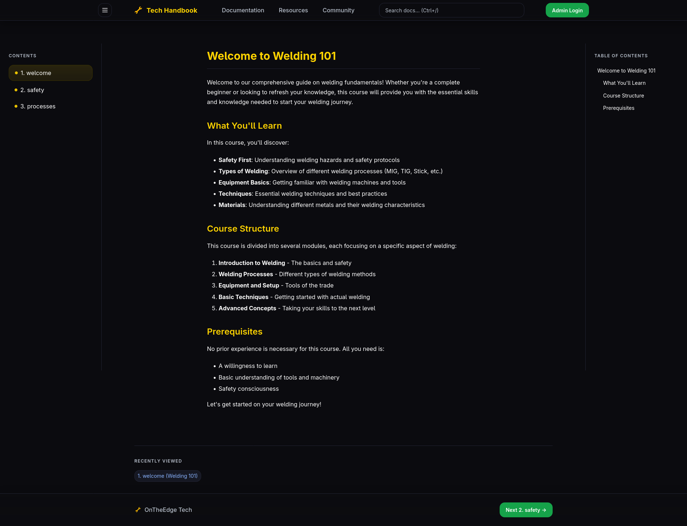

# Combined Documentation App

A modern, feature-rich documentation platform that combines the best features of TechHandBook and Welding Study App. Built with Flask, this application provides a clean interface for organizing and presenting technical documentation with powerful admin capabilities.




## Features

- **Modern UI**: Clean, dark-themed interface with responsive design
- **Course-based Organization**: Structure documentation into logical courses
- **Markdown Support**: Full Markdown formatting with syntax highlighting
- **Powerful Search**: Global search across all courses and documents
- **Admin Panel**: Full CRUD operations for managing content
- **Responsive Design**: Works seamlessly on desktop and mobile devices
- **Navigation Aids**: Table of contents, breadcrumbs, and prev/next buttons
- **Code Highlighting**: Syntax highlighting for code snippets
- **Keyboard Shortcuts**: Enhanced navigation with keyboard controls

## Installation

1. Clone the repository:
   ```bash
   git clone https://github.com/OntheEdgeTech/TechHandBook.git
   cd TechHandBook
   ```

2. Install dependencies:
   ```bash
   pip install -r requirements.txt
   ```

3. Run the application:
   ```bash
   python app.py
   ```

4. Access the app at `http://localhost` (port 80)

### Via Dockero

> get dockero : https://github.com/the-abra/dockero/

1. Clone the repository:
   ```bash
   git clone https://github.com/OntheEdgeTech/TechHandBook.git
   cd TechHandBook
   ```

2. Setup and run:
   ```bash
   dockero setup .
   ```

3. Run after setup:
   ```bash
      dockero run handbook
   ```

## Usage

### Browsing Documentation

- Visit the homepage to see available courses
- Click on a course to start browsing documentation
- Use the sidebar to navigate between documents
- Use the search bar to find specific content across all courses
- Table of contents is available on document pages

### Admin Panel

1. Visit `/login` to access the admin panel
2. Default credentials: `admin` / `password123`
3. Manage courses and documents:
   - Create, edit, and delete courses
   - Add, update, and remove documents within courses
   - Preview Markdown content in real-time
   - Reorder courses with drag and drop
   - Bulk import documents via drag and drop

## Directory Structure

```
combined-docs-app/
├── app.py              # Main application file
├── requirements.txt    # Python dependencies
├── docs/               # File-based documentation (courses)
│   └── Welding 101/    # Sample course
│       ├── info.txt    # Course description
│       ├── 1. welcome.md
│       ├── 2. safety.md
│       └── 3. processes.md
├── media/              # Static media files
├── static/             # CSS and JavaScript files
│   ├── docs_theme.css  # Main stylesheet
│   └── docs.js         # Client-side JavaScript
└── templates/          # HTML templates
    ├── docs.html       # Documentation page
    ├── landing.html    # Homepage
    ├── courses.html    # Courses listing
    ├── login.html      # Admin login
    └── admin.html      # Admin panel
```

## Technology Stack

- **Flask**: Python web framework
- **Markdown**: Content formatting with extensions
- **Fuse.js**: Client-side search functionality
- **HTML/CSS/JavaScript**: Frontend implementation

## Customization

You can customize the application by:

1. **Adding Courses**: Use the admin panel to create new courses
2. **Adding Documents**: Use the admin panel to add documents to courses
3. **Styling**: Modify `static/docs_theme.css` to change the appearance
4. **Functionality**: Update `static/docs.js` for client-side enhancements
5. **Templates**: Modify HTML templates in the `templates/` directory

## Security Note

For production deployment, make sure to:

1. Change the secret key in `app.py`
2. Change the default admin credentials
3. Implement proper authentication and authorization
4. Use HTTPS in production

## Contributing

1. Fork the repository
2. Create a feature branch (`git checkout -b feature/AmazingFeature`)
3. Commit your changes (`git commit -m 'Add some AmazingFeature'`)
4. Push to the branch (`git push origin feature/AmazingFeature`)
5. Open a pull request

## License

This project is licensed under the MIT License
