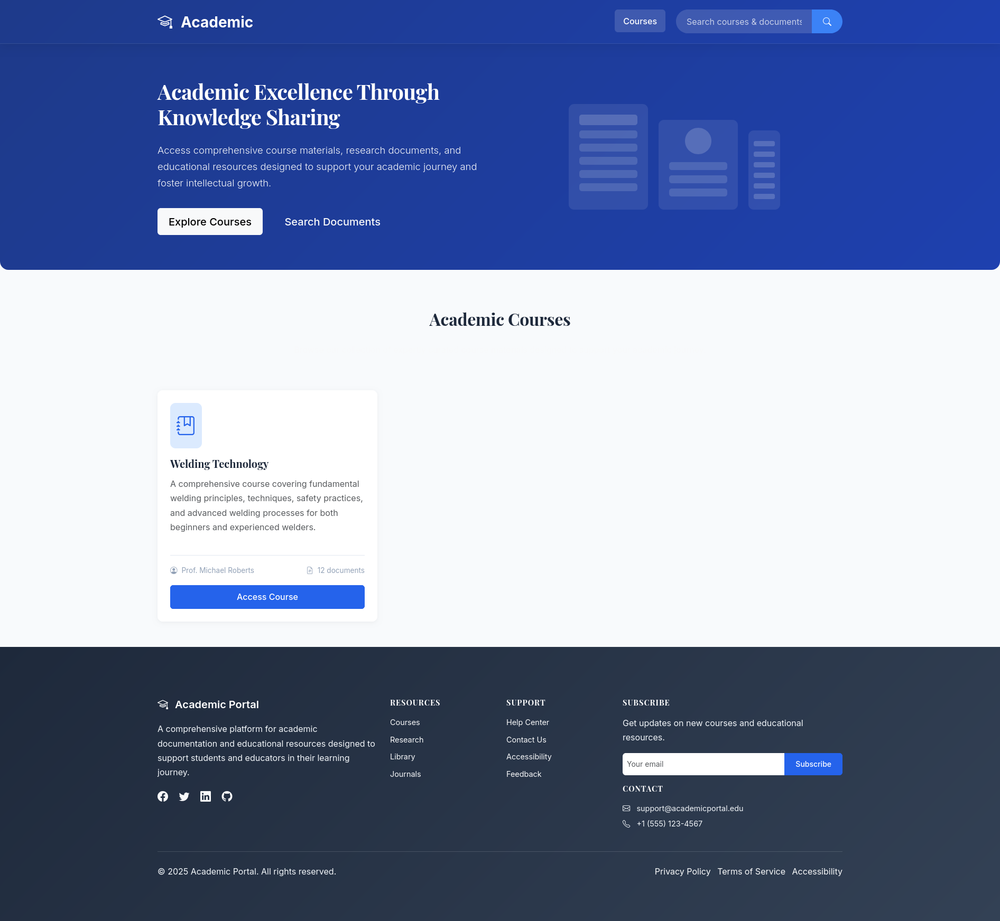
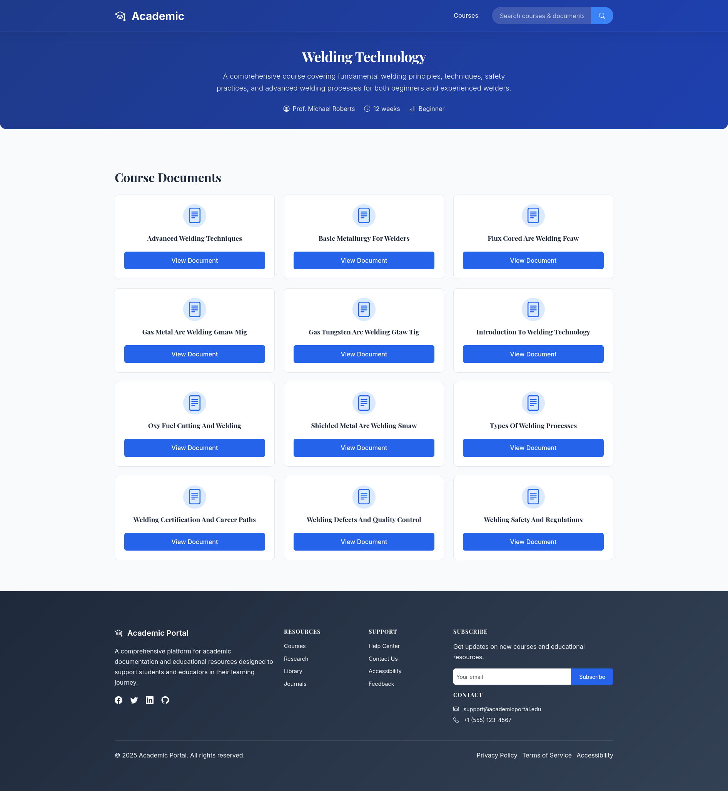

# Academic Documentation Portal

A Flask-based web application with an elegant, modern design for academic documentation and resources. This portal organizes content by courses, allowing students and educators to easily access markdown-based documents.

## Features

- Elegant modern design with focused document viewing
- Course-based organization of content
- Responsive design for all devices
- Markdown document support with syntax highlighting
- Powerful search functionality across all courses
- Clean, academic-focused interface
- Admin panel for content management
- Rich markdown editor with live preview for document creation
- Intelligent caching to minimize resource usage and improve performance

> Admin page: /admin

## Screen Snapshots




## Prerequisites

- Python 3.7 or higher
- pip (Python package installer)

## Installation

1. Clone the repository:
   ```bash
   git clone <repository-url>
   cd Academic
   ```

2. Install dependencies:
   ```bash
   pip install -r requirements.txt
   ```

## Usage

1. Run the application:
   ```bash
   python app.py
   ```

2. Open your web browser and navigate to `http://localhost:80`

## Admin Panel

The portal includes an admin panel for managing courses and documents:

- **URL**: `http://localhost:80/admin`
- **Default Credentials**: 
  - Username: `admin`
  - Password: `password`

### Admin Features

1. **Dashboard**: Overview of courses and documents
2. **Course Management**: Create, edit, and view courses
3. **Document Management**: Create and edit markdown documents with a rich text editor
4. **Live Preview**: View changes in the public portal

**Note**: For production use, you should change the default credentials in `src/config/settings.py`.

## Project Structure

```
Academic/
├── app.py                 # Application entry point
├── requirements.txt       # Python dependencies
├── README.md              # This file
├── .gitignore             # Git ignore rules
├── Dockerfile             # Docker configuration
├── CACHING.md             # Documentation on caching implementation
├── MARKDOWN_EDITOR_INTEGRATION.md  # Documentation on markdown editor
│
├── courses/               # Course content directory
│   └── welding_technology/ # Sample course
│       ├── course.json    # Course metadata
│       ├── docs/          # Markdown documents
│       └── media/         # Media files (if any)
│
├── file_storage/          # Public file storage
│   ├── landing.png        # Landing page screenshot
│   └── course.png         # Course page screenshot
│
├── src/                   # Application source code
│   ├── __init__.py        # Application factory
│   ├── config/            # Configuration files
│   ├── controllers/       # Route handlers
│   ├── models/            # Data models
│   ├── services/          # Business logic
│   └── utils/             # Utility functions
│
├── static/                # Static assets
│   ├── css/               # Stylesheets
│   ├── js/                # JavaScript files
│   └── favicon.svg        # Website favicon
│
└── templates/             # HTML templates
    ├── base.html          # Base template
    ├── index.html         # Home page
    ├── course.html        # Course page
    ├── document.html      # Document page
    ├── search.html        # Search results page
    └── admin/             # Admin templates
```

## Course Structure

The portal organizes content by courses. Each course has its own directory with the following structure:

```
courses/
├── course_name/
│   ├── course.json
│   ├── docs/
│   │   ├── document1.md
│   │   ├── document2.md
└── └── └── ...
```

### Creating a New Course (Admin Panel)

1. Navigate to the admin panel
2. Go to "Courses" and click "New Course"
3. Fill in the course details
4. The system will automatically create the directory structure

### Adding Documents to a Course (Admin Panel)

1. Navigate to the admin panel
2. Go to "Courses" and select a course
3. Click "New Document"
4. Write your document using Markdown formatting

### Creating a New Course (Manual Method)

1. Create a new directory in the `courses/` folder with a descriptive name (use underscores for spaces)
2. Inside the course directory, create:
   - A `course.json` file with course metadata
   - A `docs/` directory for markdown documents
   - A `media/` directory for images and other media files

Example `course.json`:
```json
{
  "title": "Course Title",
  "description": "Brief description of the course",
  "instructor": "Instructor Name",
  "duration": "Course duration",
  "level": "Beginner/Intermediate/Advanced"
}
```

### Adding Documents to a Course (Manual Method)

1. Create markdown files (`.md` extension) in the `docs/` directory of a course
2. The document will automatically appear in the course page
3. Use standard markdown syntax for formatting

Example document structure:
```markdown
# Document Title

## Section 1
Content here...

## Section 2
More content...
```

## Customization

### Theme
To customize the color scheme, modify the CSS variables in `static/css/style.css`:

```css
:root {
  --primary-900: #1e3a8a;    /* Deep Blue - Trust, Knowledge */
  --primary-800: #1e40af;    /* Rich Blue */
  --primary-700: #2563eb;    /* Main Primary */
  --primary-600: #3b82f6;    /* Lighter Blue */
  --primary-100: #dbeafe;    /* Very Light Blue */
  --accent-green: #10b981;   /* Emerald - Success, Growth */
  --accent-amber: #f59e0b;   /* Amber - Warnings, Highlights */
  --accent-red: #ef4444;     /* Red - Advanced Level */
}
```

## Caching

This application implements intelligent caching to minimize resource usage and improve performance:

- Course listings are cached for 5 minutes
- Document content is cached for 5 minutes
- Search results are cached for 5 minutes
- Cache is automatically cleared when content changes

## Rich Markdown Editor

The admin panel includes a rich markdown editor (EasyMDE) for creating and editing documents:

- Real-time preview
- Toolbar with formatting options
- Syntax highlighting for code blocks
- Side-by-side editing mode
- Fullscreen editing mode

## Docker Support

The application includes a Dockerfile for containerized deployment:

```bash
docker build -t academic-portal .
docker run -p 80:80 academic-portal
```

## License

This project is licensed under the MIT License.
